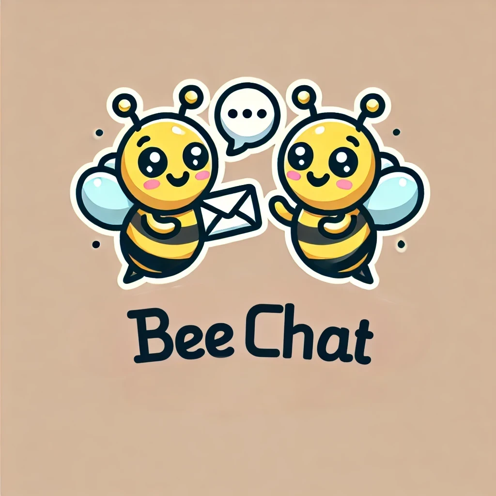

<p align="center">
  
</p>

# BeeChat

Ok, BeeMail 2.0 was a runaway success. Our user numbers are off the charts. And
our AWS bill is... well, let's not talk about it. We raised more venture capital
though! So we're going to add a new feature: instant messaging. We're calling it
**BeeChat**.

## User Interface

Our front-end engineers have put together the UI, which you can see in the
`client` folder.

To run the front-end, make sure you have the Live Server extension installed in
VS Code, then right-click on `index.html` and select _Open with Live Server_.

> [!NOTE]
>
> The front-end expects a WebSocket server to be running on port `5001`.

## WebSockets

We're using WebSockets to put the "instant" in instant messaging. That's where
you come in. We need you to work in the `server` directory and create a
WebSocket server. We're looking to develop this in two stages.

### Stage 1: Global messaging

If a user sends a message without specifying an ID, the message should be sent
to **every connected client**. This will really bring the community together!

1. If a recipient ID is not included in the UI, the client sends a JSON object
   like this:

   ```json
   {
     "recipientId": "",
     "content": "Hello, world"
   }
   ```

   i.e. the `recipientId` is a blank string.

2. If `recipientId` is not provided (it's blank), the server should send the
   `content` to every connected client (including the sender).

3. When sending a message from the server (to a client or clients), send the
   message as a JSON object that looks like this:

   ```json
   {
      "senderId": 0,
      "content": "Hello from the server!"
   }
   ```

   The `senderId` key is _optional_; if you don't include it, it won't be
   reported in the UI.

4. Make sure to use the Tech Docs guide for your language to help you get the
   server running:

   - [Javascript](https://tech-docs.corndel.com/express/web-socket-server.html)
   - [Java]()
   - [Python]()
   - [C#]()

### Stage 2: Targeted messaging

If you manage to get global messaging working, well done! That is a great
achievement.

Stage 2 is more challenging, so have fun working on it but don't be discouraged
if you don't quite get it working. What we'd like is to allow users to send
messages to particular users by their ID.

1. When a new WebSocket is created on the server, create a new `User` object.
   Assign the user an ID and save a reference to their socket.

   ```mermaid
   classDiagram
    class User {
        +int id
        -Socket socket
        +receiveMessage(Message message)
    }
   ```

2. The `receiveMessage` method should send the message to the user by using the
   user's socket.

3. When a message of the form

   ```json
   {
     "recipientId": 3,
     "content": "Hello, number 3!"
   }
   ```

   is sent to the server, the `recipientId` is defined, and so the message
   should only be sent to the user with ID `3`.

4. For the full chat experience, the message should also be delivered to the
   sender, so that both sender and recipient can see the chat history.

> [!TIP]
>
> To simplify things a little, you could create an `allUsers` list. When a new
> user connects, just push their socket onto the end of the list. The user "id"
> is just the index of their socket in the list.
